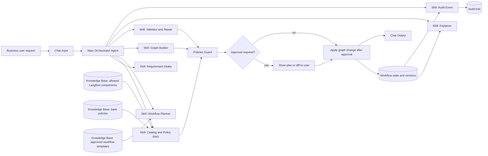

# AI Copilot для Langflow 1.9: архитектура и пошаговая сборка

## 1. Что мы строим

Мы строим AI Copilot для Langflow 1.9, который позволяет бизнес-пользователю:

- описать задачу обычным языком;
- получить черновой workflow;
- редактировать workflow через текстовые команды;
- получать объяснение, что именно делает workflow;
- работать в банковых ограничениях: только разрешенные компоненты, модели и действия, с audit trail и контролем риска.

Это не один "умный агент", а оркестратор skills. Каждый skill решает отдельную подзадачу:

1. Requirement Intake: понимает запрос и решает, хватает ли данных.
2. Catalog + Policy RAG: поднимает разрешенные компоненты Langflow и банковые политики.
3. Workflow Planner: строит понятный бизнес-план будущего workflow.
4. Graph Builder: переводит план в структуру графа.
5. Validator + Repair: проверяет граф и предлагает минимальные исправления.
6. Explainer: объясняет workflow бизнес-пользователю.
7. Audit: фиксирует, что сделал copilot и на каком основании.

Главный orchestrator вызывает эти skills как tools через Run Flow.

## 2. Почему архитектура через skills правильная

Гипотеза "строить все через skills" для этого кейса сильная по пяти причинам:

1. Масштабируемость. Добавление нового сценария не ломает главный flow, а добавляет новый skill или новую базу знаний.
2. Контроль качества. Intake, validation и explanation можно тестировать отдельно.
3. Банковая безопасность. Политики и ограничения можно применять не только к финальному ответу, но и к этапам планирования и изменения workflow.
4. Переиспользование. Те же skills потом можно использовать для API, внутреннего copilot UI или другой low-code платформы.
5. Применимость в Langflow 1.9. Langflow хорошо поддерживает flows-as-tools через Run Flow и Agent, а также Knowledge Base, Policies, JSON/Table-компоненты и версионирование flow.

## 3. Архитектура решения

### 3.1. Основные слои

#### Слой UX

Пользователь пишет: что хочет получить, какие данные использовать, какой результат ожидается.

Copilot не заставляет его мыслить нодами. Вместо этого он:

- определяет, это build, edit, explain или validate;
- задает максимум 2-3 уточнения;
- показывает план или diff до применения;
- просит approval перед рискованными действиями.

#### Слой orchestration

Главный Agent не строит workflow напрямую. Он вызывает навыки:

- Intake
- RAG
- Planner
- Builder
- Validator
- Explainer
- Audit

Это делает поведение управляемым и предсказуемым.

#### Слой context engineering

В модель нельзя передавать весь canvas Langflow в сыром виде. Поэтому используется компактный state object:

- intent;
- user goal;
- graph_spec;
- retrieved_context;
- policy_decisions;
- validation_report;
- approval_state.

В модель идет не весь шум, а только:

- запрос пользователя;
- релевантные компоненты;
- релевантные политики;
- текущая версия workflow;
- diff изменений;
- ошибки валидации.

#### Слой RAG

RAG нужен не для "общих знаний", а для трех прикладных индексов:

1. Каталог разрешенных компонентов Langflow 1.9.
2. Банковые политики и ограничения.
3. Одобренные шаблоны workflow.

За счет этого copilot отвечает не абстрактно, а в рамках конкретного enterprise-контура.

#### Слой prompt engineering

Для каждого skill свой prompt:

- Intake не генерирует граф, а извлекает intent и missing info.
- Planner строит бизнес-план, а не ноды.
- Builder генерирует graph spec.
- Validator ищет несовместимости портов, пропущенные параметры и policy violations.
- Explainer говорит человеческим языком.

#### Слой guardrails / policies

Copilot обязан:

- использовать только разрешенные модели;
- использовать только разрешенные компоненты;
- запрещать custom code без allow-list;
- требовать approval для внешних вызовов, email, записи в БД, записи в файлы;
- не раскрывать секреты и чувствительные данные;
- сохранять audit events.

#### Слой audit trail

Для каждого запроса фиксируется:

- кто запросил;
- что хотел сделать;
- какой контекст был поднят из RAG;
- какой graph version был сгенерирован;
- какой validation result был получен;
- требовался ли approval;
- какой policy decision был принят.

## 4. Как это выглядит как workflow

## 5. Что уже подготовлено в папке

Используй эти файлы:

- `component_catalog.csv`
- `bank_policies.csv`
- `example_workflows.csv`
- `workflow_state_schema.json`
- `skill_prompts.md`
- `architecture_workflow.mmd`

Путь:

`C:\Users\evgen\Downloads\project1\langflow_copilot_seed`

## 6. Пошаговая сборка в Langflow 1.9

Ниже логика сборки в правильном порядке.

### Шаг 1. Настроить модель

Нужно сначала выбрать любой доступный провайдер LLM, иначе skills и agent не заработают.

### Шаг 2. Создать базы знаний

Нужно создать 3 Knowledge Base:

1. `lf_component_catalog`
2. `bank_policies`
3. `approved_workflow_templates`

### Шаг 3. Создать skill-flows

Нужно создать отдельные flows:

1. `SKILL - Requirement Intake`
2. `SKILL - Catalog RAG`
3. `SKILL - Workflow Planner`
4. `SKILL - Graph Builder`
5. `SKILL - Validator Repair`
6. `SKILL - Explainer`
7. `SKILL - Audit`

### Шаг 4. Создать главный orchestrator flow

Нужно создать flow:

`AI Copilot - Orchestrator`

В нем будут:

- Chat Input
- Agent
- Chat Output
- Language Model
- Run Flow для каждого skill
- Policies

### Шаг 5. Протестировать build, edit, explain

Проверяем три режима:

1. Build нового workflow.
2. Edit существующего workflow.
3. Explain существующего workflow.

## 7. Критерии качества решения

### UX постановки и редактирования

- максимум 2-3 уточнения;
- бизнес-термины вместо терминов нод;
- показ плана или diff перед применением;
- объяснение того, что будет построено.

### Архитектура

- skill-based orchestration;
- RAG поверх enterprise knowledge;
- policy-aware decisions;
- compact state and validation loop.

### Применимость в Langflow

- Run Flow как tool;
- Knowledge Base;
- Agent;
- Policies;
- JSON / Table;
- Flow Version History.

### Корректность результата

- проверка разрешенных компонентов;
- проверка параметров;
- проверка совместимости портов;
- проверка policy violations;
- repair loop не более 2 итераций.

### Масштабирование

- новые заказчики добавляют свои KB и policies;
- skill-архитектура упрощает поддержку;
- можно переносить на другие low-code платформы с минимальной заменой builder/validator слоя.

## 8. Рекомендуемые вопросы Дмитрию

1. Какие компоненты Langflow считаются разрешенными в demo и в целевом enterprise-контуре?
2. Нужно ли реально модифицировать canvas или достаточно строить graph spec и diff?
3. Какие модели официально разрешены?
4. Нужно ли обязательное approval перед любым изменением workflow или только перед risky actions?
5. Какие действия считать risky: email, HTTP, DB write, file write, MCP calls?
6. Какой формат audit trail ожидается в прототипе?
7. Нужен ли multi-user RBAC в прототипе?
8. Какие 2-3 пользовательских кейса жюри точно будет смотреть?

## 9. Минимальная демо-сценарная линия

### Сценарий 1. Создание

Пользователь:

"Собери workflow, который анализирует диалоги по продукту X за 2 недели, выделяет инсайты и причины недовольства, формирует отчет."

Copilot:

- понимает intent;
- поднимает шаблон аналитического workflow;
- предлагает план;
- строит graph spec;
- валидирует;
- объясняет.

### Сценарий 2. Редактирование

Пользователь:

"Добавь проверку PII и замени способ доставки результата."

Copilot:

- строит diff;
- проверяет policy impact;
- показывает, что изменит;
- просит approval, если действие рискованное.

### Сценарий 3. Объяснение

Пользователь:

"Объясни этот workflow простыми словами."

Copilot:

- описывает шаги;
- говорит, какие данные использует;
- говорит, где риски и что можно редактировать.

