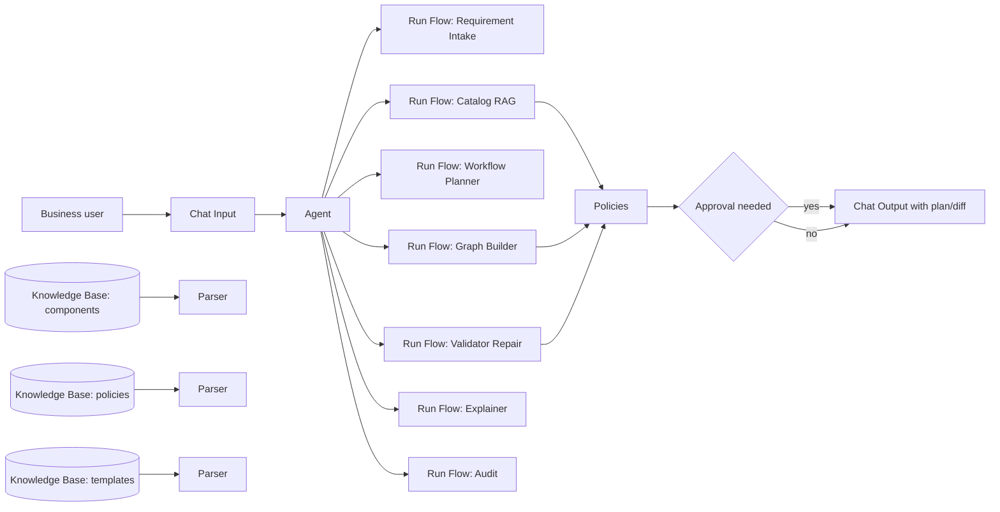

# AI Copilot для Langflow 1.9: архитектура и сборка с учетом `all.json`

Этот файл обновлен по фактическому каталогу компонентов из [all.json](/C:/Users/evgen/Downloads/project1/all.json), а не только по документации.

## Что подтвердилось по твоей сборке

В установленном Langflow реально есть нужные компоненты:

- `input_output.ChatInput` -> `Chat Input`
- `input_output.ChatOutput` -> `Chat Output`
- `input_output.TextInput` -> `Text Input`
- `input_output.TextOutput` -> `Text Output`
- `models_and_agents.Agent` -> `Agent`
- `models_and_agents.LanguageModelComponent` -> `Language Model`
- `models_and_agents.Prompt Template` -> `Prompt Template`
- `models_and_agents.Memory` -> `Message History`
- `models_and_agents.policies` -> `Policies`
- `files_and_knowledge.KnowledgeBase` -> `Knowledge Base`
- `flow_controls.RunFlow` -> `Run Flow`
- `flow_controls.ConditionalRouter` -> `If-Else`
- `processing.DataOperations` -> `JSON Operations`
- `processing.DataFrameOperations` -> `Table Operations`
- `processing.ParserComponent` -> `Parser`
- `processing.ParseData` -> `Data to Message`

Это значит, что основная архитектура остается правильной. Нужно только точнее привязать ее к доступным названиям компонентов.

## Что меняется в архитектуре

### 1. Skill-flows делаем через `Text Input` и `Text Output`

Это лучшая схема для `Run Flow` как tools.

Базовый шаблон skill-flow:

`Text Input -> Prompt Template -> Language Model -> Text Output`

### 2. Главный Copilot-flow делаем через `Chat Input`, `Agent`, `Chat Output`

Базовый шаблон orchestrator-flow:

`Chat Input -> Agent -> Chat Output`

А skill-flows подключаем к `Agent` через `Run Flow`.

### 3. `Knowledge Base` в твоей сборке отдает `Results` типа `Table`

Это важно. Значит результат KB не всегда удобно подавать напрямую в prompt.

Рекомендуемая схема RAG-skill:

`Text Input -> Knowledge Base -> Parser -> Prompt Template -> Language Model -> Text Output`

Если нужно сложнее:

- `Table Operations` для фильтрации;
- `Data to Message` для перевода JSON в текст;
- `JSON Operations` для правки структурированных выходов builder/validator.

### 4. `Policies` можно оставлять в прототипе

Компонент `Policies` у тебя реально есть, значит policy-aware архитектура не только концептуальна, но и применима в demo.

Но порядок внедрения должен быть таким:

1. Сначала MVP без `Policies`
2. Потом `Policies` между `Run Flow` и `Agent`

## Обновленная техническая архитектура

Решение строится как skill-based AI Copilot над Langflow 1.9. Бизнес-пользователь формулирует задачу верхнеуровнево, а Copilot переводит ее в рабочий workflow не напрямую, а через управляемый конвейер навыков. Входной запрос сначала проходит через skill `Requirement Intake`, который определяет intent, недостающие данные и необходимость approval. Затем включается `Catalog + Policy RAG`, который поднимает разрешенные компоненты Langflow, банковые политики и approved templates. После этого `Workflow Planner` формирует понятный бизнес-план будущего workflow. Только затем `Graph Builder` создает graph spec, а `Validator + Repair` проверяет совместимость компонентов, параметры, ограничения и policy violations. Если workflow меняется или требует рискованных действий, Copilot сначала показывает пользователю план или diff, а применение выполняется только после approval. Отдельный `Explainer` объясняет workflow бизнес-языком, а `Audit` фиксирует trace событий, решений и версий. В Langflow это реализуется через главный `Agent`, подключенные через `Run Flow` skill-flows, `Knowledge Base` для RAG, `Parser` и `Table Operations` для подготовки контекста, `JSON Operations` для работы со structured outputs и `Policies` для guardrails.

## Обновленный workflow

## Рекомендуемый состав MVP

### Skill-flows

1. `SKILL - Requirement Intake`
2. `SKILL - Catalog RAG`
3. `SKILL - Workflow Planner`
4. `SKILL - Graph Builder`
5. `SKILL - Validator Repair`
6. `SKILL - Explainer`
7. `SKILL - Audit`

### Главный flow

`AI Copilot - Orchestrator`

Компоненты:

- `Chat Input`
- `Agent`
- `Chat Output`
- `Run Flow` x7
- позднее `Policies`

## Практические правила сборки

### Rule 1

Не использовать `Chat Input` внутри skill-flows. Для них лучше `Text Input`.

### Rule 2

Не строить первый MVP сразу через `Policies`. Сначала добейся, чтобы orchestrator вызывал skills.

### Rule 3

Не передавать в модель весь canvas. Передавать только:

- intent;
- user request;
- retrieved allowed components;
- retrieved policies;
- current workflow summary;
- graph diff;
- validation result.

### Rule 4

Для реального банка `Write File`, внешние API и интеграции должны считаться risky actions и требовать approval.

## Что изменить в презентации

В презентации лучше говорить не просто "используем skills", а:

"Архитектура строится как Langflow-native skill orchestration: skills реализованы отдельными flows и подключаются в основной Copilot как tools через `Run Flow`, а enterprise-контекст подается через `Knowledge Base` и policy-aware routing."

## Что использовать как источник истины по компонентам

Для демо и схемы теперь опирайся в первую очередь на:

- [all.json](/C:/Users/evgen/Downloads/project1/all.json)
- [component_catalog.csv](/C:/Users/evgen/Downloads/project1/langflow_copilot_seed/component_catalog.csv)

А документацию Langflow используй как вспомогательный слой.
