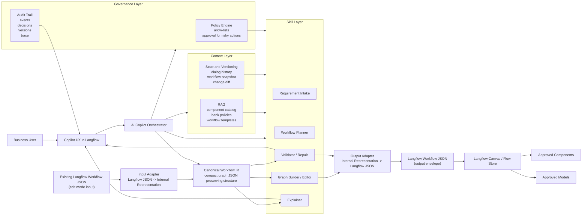

# High-Level Architecture for AI Copilot in Langflow

Files:

- [architecture_high_level.mmd](/C:/Users/evgen/Downloads/project1/langflow_copilot_seed/architecture_high_level.mmd)
- [architecture_high_level.png](/C:/Users/evgen/Downloads/project1/langflow_copilot_seed/architecture_high_level.png)
- [architecture_high_level.jpg](/C:/Users/evgen/Downloads/project1/langflow_copilot_seed/architecture_high_level.jpg)

## Key idea

The architecture is centered around an internal canonical workflow representation.

- In **edit mode**, the incoming Langflow workflow JSON is first converted into the internal representation.
- The Copilot performs planning, editing, validation, and explanation over that internal representation.
- On output, the updated internal representation is converted back into Langflow-compatible JSON.

## Mermaid

